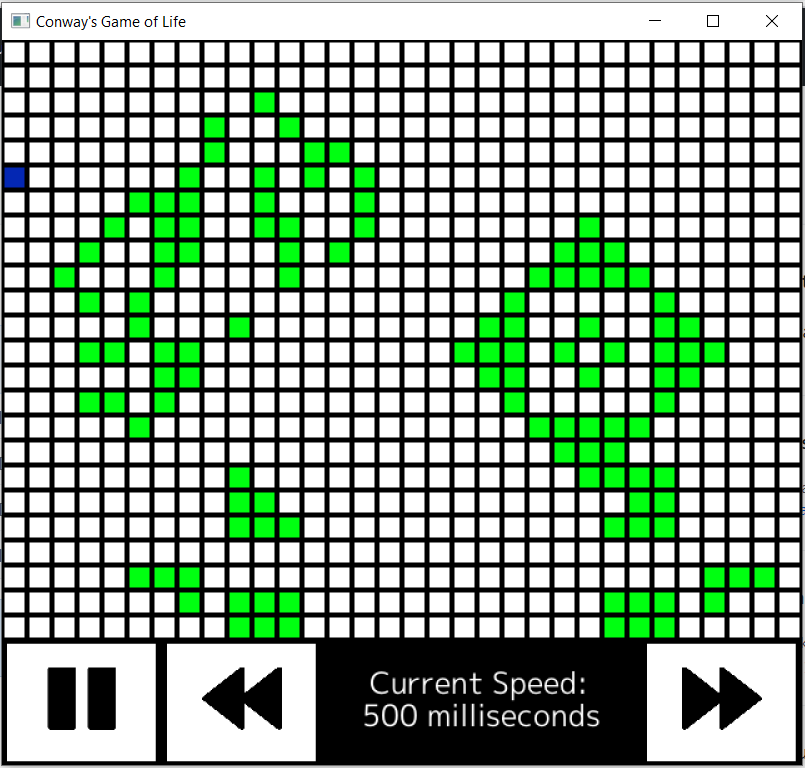

# Life
A simple implementation of Conway's game of life. Made using [Ebiten](https://github.com/hajimehoshi/ebiten), a 2D game library for Go

# Features

- Click and drag to create "Live" cells. Clicking on dead cells turns them into live cells, and vice-versa
- Allows users to pause the simulation, or increase/decrease the intervals in between calculating the new states

# How to use

Clone this repository. Navigate to the /cmd/ folder and go run/build main.go
